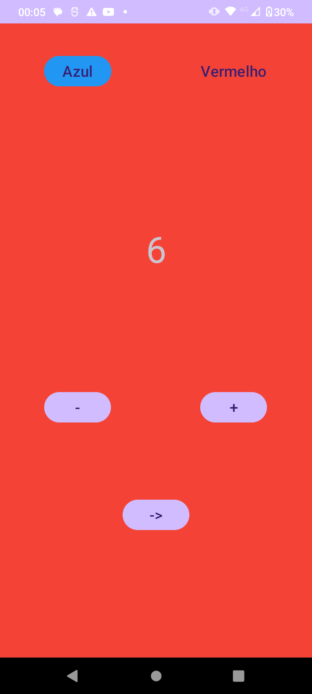
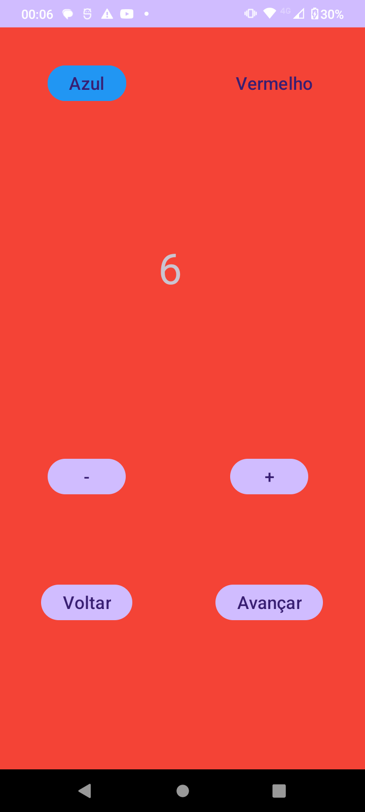
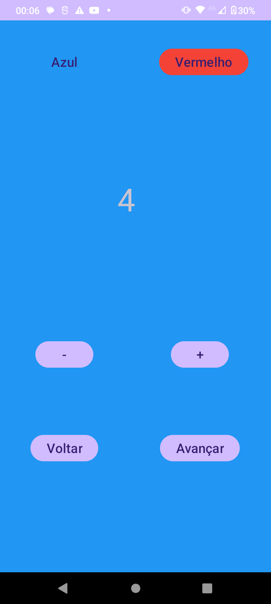
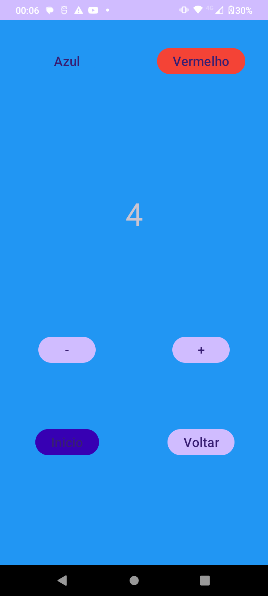
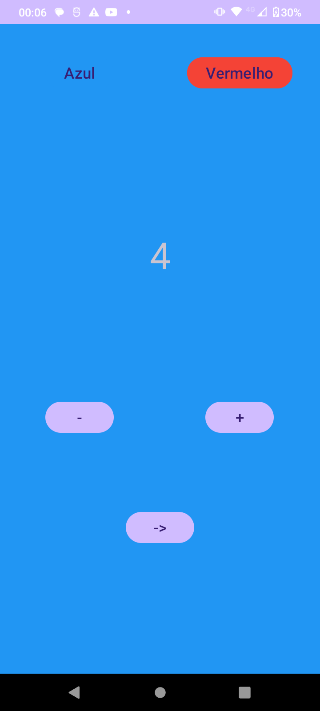

# Teste de Telas
Aplicação Android feito em Java para teste de navegação entre telas com compatilhamento de informação, com alteração de propriedade do layout via interface. 

O usuário tem a capacidade de alternar a cor da tela entre azul e vermelho, diminuir e aumentar o número mostrado na tela, e navegar entre 3 telas sem perda de informação. 

## Screenshots
        
